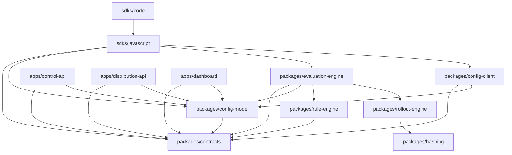

# Monorepo Structure & Dependency DAG

## 1. Directory Tree

```text
controlplane/
├── apps/
│   ├── dashboard/          # Next.js management dashboard
│   ├── control-api/        # Fastify Management API
│   └── distribution-api/  # Fastify Distribution API
├── packages/
│   ├── contracts/          # Zod schemas, shared types & contracts
│   ├── config-model/       # Configuration data models & validation
│   ├── hashing/            # Deterministic SHA-256 canonical hashing & bucketing
│   ├── rule-engine/        # Rule condition & operator evaluation
│   ├── rollout-engine/     # Percentage rollout calculation
│   ├── evaluation-engine/  # In-memory evaluation pipeline
│   └── config-client/      # SDK configuration store & caching adapters
├── sdks/
│   ├── javascript/         # Browser JavaScript SDK
│   ├── node/               # Node.js SDK
│   └── flutter/            # Flutter / Dart SDK
├── tests/
│   ├── contract/           # API and snapshot contract validation
│   ├── integration/        # End-to-end integration tests
│   ├── compatibility/      # Cross-SDK golden test vectors
│   └── load/               # Local evaluation throughput benchmarks
├── infrastructure/
│   ├── docker/             # Dockerfiles & docker-compose.yml
│   ├── database/           # SQL initialization scripts
│   └── deployment/         # Environment templates
├── docs/
│   ├── architecture/       # System diagrams & boundaries
│   ├── decisions/          # Architecture Decision Records (ADRs)
│   ├── api/                # API specifications
│   ├── sdk/                # SDK guides
│   └── operations/         # Deployment & reliability guides
└── scripts/                # Verification & build utilities
```

---

## 2. Dependency Directed Acyclic Graph (DAG)



### Dependency Invariants

1. **No Circular Dependencies**: `packages/contracts` and `packages/hashing` are leaf modules with zero internal workspace dependencies.
2. **Strict Layering**: `apps/*` and `sdks/*` depend on `packages/*`, but `packages/*` never depend on `apps/*` or `sdks/*`.
3. **Deterministic Evaluation Separation**: `evaluation-engine` aggregates pure business logic without database or HTTP transport dependencies.
